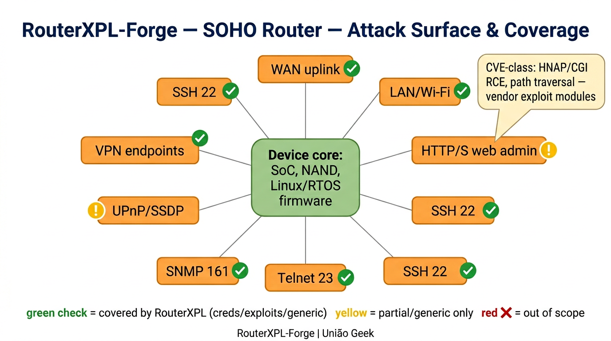
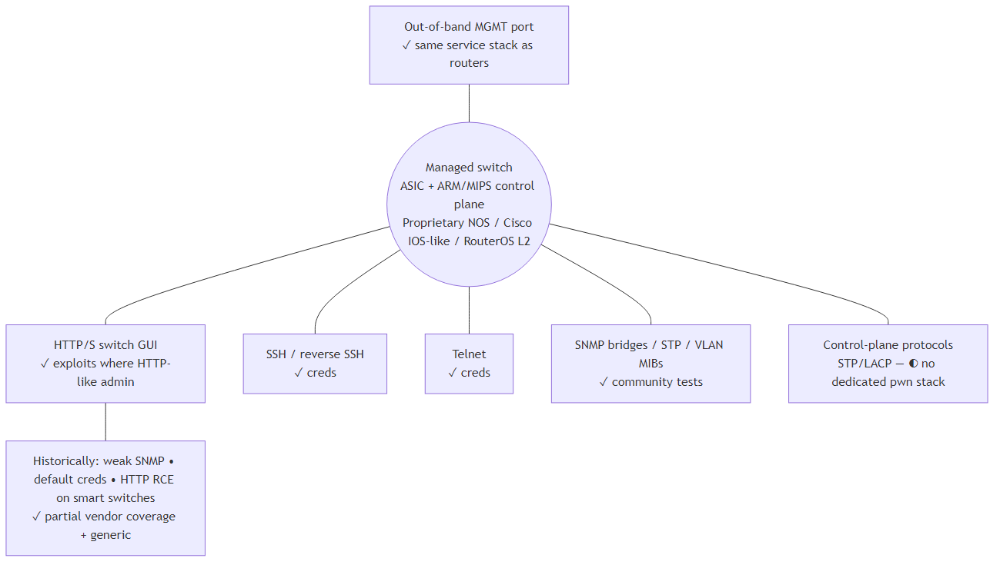
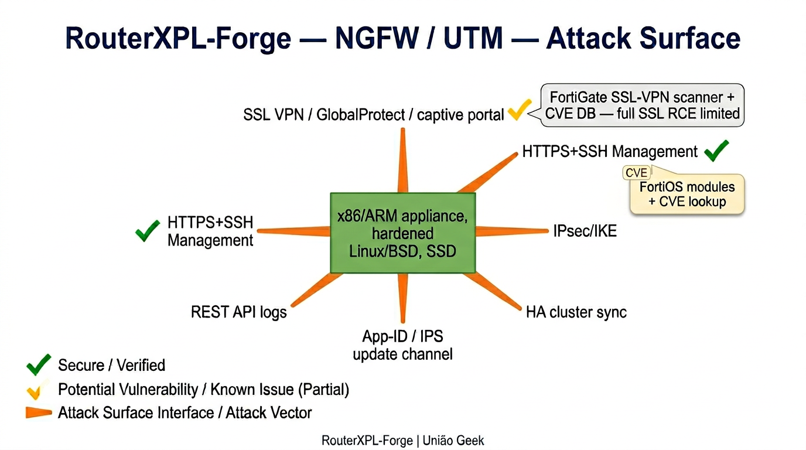
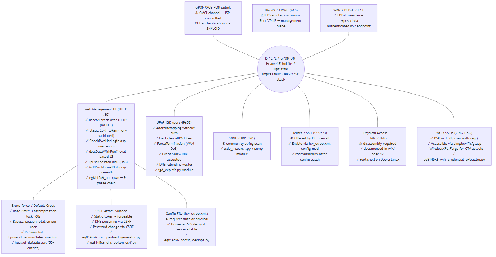
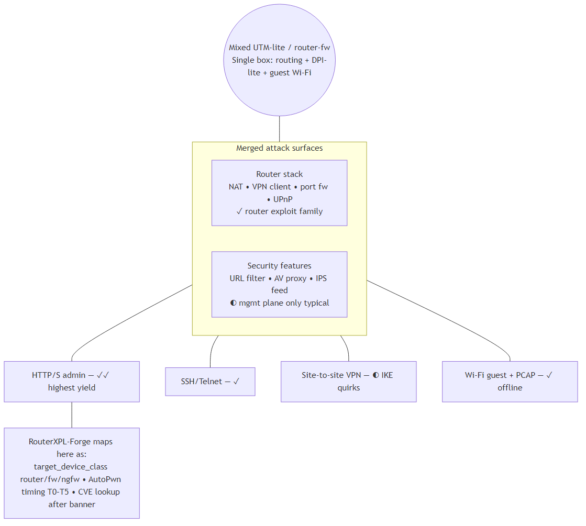

# Pasta `docs/` — documentação do repositório

**Idioma:** Português (Brazil). **English (en-US, default):** [README.md](README.md)

**Author:** André Henrique ([@mrhenrike](https://github.com/mrhenrike)) \| **União Geek** — [https://github.com/Uniao-Geek](https://github.com/Uniao-Geek)

## Ficheiros principais

| Ficheiro | Idioma do corpo | Descrição |
|----------|-----------------|-----------|
| [COVERAGE_MATRIX.md](COVERAGE_MATRIX.md) | en-US (gerado) | Matriz de cobertura e tabelas de intel externa |
| [FULL_CATALOG.md](FULL_CATALOG.md) | en-US (gerado) | Catálogo textual de módulos |
| [wiki/README.md](wiki/README.md) | Hub bilíngue | Índice da wiki (en-US + pt-BR) |
| [diagrams/architecture/](diagrams/architecture/) | en-US + pt-BR | Diagramas de arquitetura / superfície de ataque |
| [img/architecture/](img/architecture/) | rótulos en-US nos PNG | Imagens exportadas |

## Arquitetura / superfície de ataque (PNGs)

Estilo hub-and-spoke (como no MikrotikAPI-BF). **Mermaid:** [diagrams/architecture/](diagrams/architecture/).

| Router SOHO | Switch |
|:---:|:---:|
|  |  |

| NGFW / UTM | CPE ISP |
|:---:|:---:|
|  |  |

| Edge misto |
|:---:|
|  |

## Wiki

- **Português:** [wiki/pt-BR/README.md](wiki/pt-BR/README.md)
- **English:** [wiki/en-US/README.md](wiki/en-US/README.md)

## Regenerar artefactos

```bash
python tools/generate_coverage_matrix.py
python tools/generate_full_catalog.py
python tools/refresh_cve_extended_catalog.py
python tools/gen_wiki_module_index.py
```

## Nota sobre `docs/modules/`

Ficheiros Markdown sob `docs/modules/` são sobretudo **inglês** (metadados gerados ou legados). Para guias de utilização em **pt-BR**, use a wiki em [wiki/pt-BR/](wiki/pt-BR/).

---

> **Author:** André Henrique ([@mrhenrike](https://github.com/mrhenrike)) \| **União Geek** — [https://github.com/Uniao-Geek](https://github.com/Uniao-Geek)
