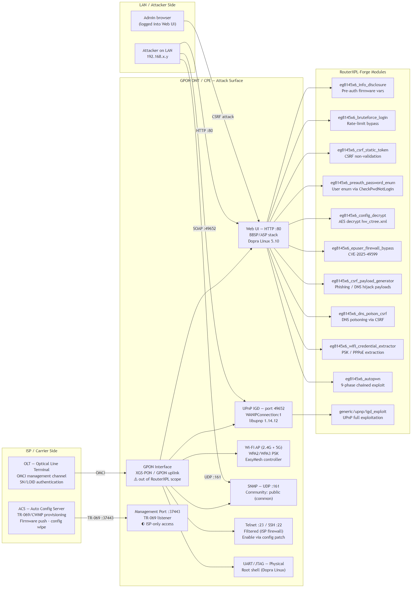

# EmbedXPL-Forge — Wiki (bilingual)

**Author:** André Henrique ([@mrhenrike](https://github.com/mrhenrike)) | [União Geek](https://github.com/Uniao-Geek)

## Languages / Idiomas

| Locale | Hub |
|--------|-----|
| **English (en-US)** — default | [en-US/README.md](en-US/README.md) |
| **Português (pt-BR)** | [pt-BR/README.md](pt-BR/README.md) |

## Architecture Diagrams

PNG gallery. Mermaid sources: [../diagrams/architecture/README.md](../diagrams/architecture/README.md).

| SOHO Router | Managed Switch |
|:-----------:|:--------------:|
|  |  |

| ISP CPE / GPON ONT | Mixed Edge |
|:------------------:|:----------:|
|  |  |

| GPON ONT Full Attack Map |
|:------------------------:|
|  |

## Shared Resources

- **Module path index (all locales):** [ANEXO-INDICE-MODULOS.md](ANEXO-INDICE-MODULOS.md) — regenerate with `python tools/gen_wiki_module_index.py`

## Governance

| Topic | Link |
|-------|------|
| License | [LICENSE](../../LICENSE) (BSD) |
| Code of Conduct | [CODE_OF_CONDUCT.md](../../CODE_OF_CONDUCT.md) |
| Security | [SECURITY.md](../../SECURITY.md) |
| Contributors | [CONTRIBUTORS.md](../../CONTRIBUTORS.md) |

## Repository Root

- [README.md](../../README.md) (en-US) · [README.pt-BR.md](../../README.pt-BR.md)
- [docs/README.md](../README.md) — docs folder hub

---

> **Author:** André Henrique ([@mrhenrike](https://github.com/mrhenrike)) | **União Geek** — [https://github.com/Uniao-Geek](https://github.com/Uniao-Geek)
